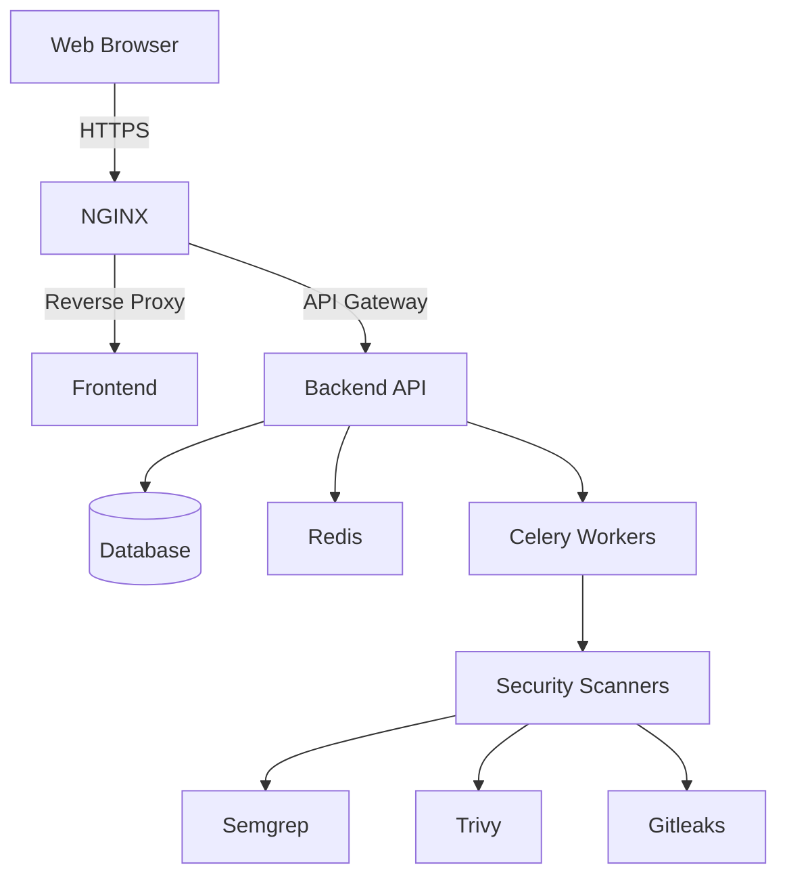

# 🛡️ DefenSys: AI-Powered Application Security Platform

**Enterprise-Grade Security Scanning for Modern Development Teams**

## 📝 Table of Contents
- [Introduction](#-introduction)
- [Key Features](#-key-features)
- [Technology Stack](#-technology-stack)
- [System Architecture](#-system-architecture)
- [Installation Guide](#-installation-guide)
- [Usage Examples](#-usage-examples)
- [API Documentation](#-api-documentation)
- [Security Considerations](#-security-considerations)
- [Contributing](#-contributing)
- [License](#-license)

## 🌟 Introduction

DefenSys is a cutting-edge application security platform that integrates static application security testing (SAST) with AI-powered vulnerability detection. Designed for modern development workflows, it provides developers with actionable security insights directly in their development lifecycle.

### The Challenge

In today's rapidly evolving threat landscape, development teams face increasing pressure to deliver secure applications without compromising development velocity. Traditional security tools often suffer from:

- High false positive rates
- Complex integration requirements
- Steep learning curves
- Limited contextual awareness
- Poor developer experience

DefenSys addresses these challenges through its intelligent scanning engine and developer-friendly interface, making application security accessible to teams of all sizes.

## ✨ Key Features

### 🔍 Intelligent Security Scanning
- **Multi-Language Support**: Detects vulnerabilities across multiple programming languages
- **AI-Powered Analysis**: Leverages machine learning to reduce false positives
- **Real-time Feedback**: Instant security feedback during development
- **Comprehensive Coverage**: Identifies OWASP Top 10 vulnerabilities and beyond

### 📊 Actionable Insights
- **Prioritized Findings**: Risk-based vulnerability prioritization
- **Remediation Guidance**: Step-by-step fix recommendations
- **Historical Analysis**: Track security posture over time
- **Compliance Reporting**: Generate audit-ready security reports

### 🛠️ Developer Experience
- **Seamless Integration**: Native support for CI/CD pipelines
- **IDE Plugins**: Real-time scanning in popular development environments
- **API-First Design**: Comprehensive RESTful API for automation
- **Extensible Architecture**: Plugin system for custom security rules

## 🏗️ Technology Stack

### Backend
- **Framework**: FastAPI (Python 3.10+)
- **Authentication**: JWT with OAuth2
- **Database**: SQLite (Development), PostgreSQL (Production)
- **Task Queue**: Celery with Redis
- **API Documentation**: OpenAPI 3.0 (Swagger UI)

### Frontend
- **Framework**: React 18 with TypeScript
- **State Management**: React Query
- **UI Components**: shadcn/ui with Tailwind CSS
- **Data Visualization**: Recharts
- **Build Tool**: Vite

### Security Tools
- **Static Analysis**: Semgrep integration
- **Dependency Scanning**: OWASP Dependency-Check
- **Secrets Detection**: Gitleaks
- **Container Security**: Trivy

## 🏛️ System Architecture



### Core Components

1. **API Gateway**: Handles authentication, rate limiting, and request routing
2. **Scan Engine**: Manages security scans and orchestrates analysis tools
3. **Vulnerability Database**: Central repository for security findings
4. **Notification Service**: Real-time alerts and reporting
5. **User Management**: Role-based access control (RBAC)

## 🚀 Installation Guide

### Prerequisites

- **Node.js** 18+ (LTS recommended)
- **Python** 3.10+
- **Docker** and **Docker Compose** (for production deployment)
- **Git**

### Local Development Setup

1. **Clone the repository**
   ```bash
   git clone https://github.com/your-org/defensis-web-core.git
   cd defensis-web-core
   ```

2. **Set up the backend**
   ```bash
   # Create and activate virtual environment
   python -m venv venv
   source venv/bin/activate  # On Windows: .\venv\Scripts\activate
   
   # Install dependencies
   cd server
   pip install -r requirements-dev.txt
   ```

3. **Set up the frontend**
   ```bash
   cd ../client
   npm install
   ```

4. **Configure environment variables**
   ```bash
   cp .env.example .env
   # Edit .env with your configuration
   ```

5. **Start the development servers**
   ```bash
   # In first terminal (backend)
   cd server
   uvicorn app:app --reload
   
   # In second terminal (frontend)
   cd client
   npm run dev
   ```

6. **Access the application**
   - Frontend: http://localhost:5173
   - API Documentation: http://localhost:8000/api/docs

### Production Deployment

```bash
# Using Docker Compose
docker-compose -f docker-compose.prod.yml up -d
```

## 💻 Usage Examples

### Running a Security Scan

1. **Via Web Interface**
   - Navigate to the "Scans" section
   - Select your repository
   - Choose scan type (Quick/Full/Custom)
   - Click "Start Scan"
   - View real-time progress and results

2. **Via API**
   ```bash
   # Start a new scan
   curl -X POST "http://localhost:8000/api/scans" \
     -H "Authorization: Bearer YOUR_TOKEN" \
     -H "Content-Type: application/json" \
     -d '{"repository_id": "your-repo-id", "scan_type": "full"}'
   ```

### Reviewing Findings

1. **Dashboard Overview**
   - Security score and trends
   - Recent vulnerabilities
   - Scan history

2. **Vulnerability Details**
   - Severity assessment
   - Affected files
   - Remediation steps
   - References to security advisories

## 📚 API Documentation

Interactive API documentation is available at `/api/docs` when running the application locally.

### Key Endpoints

| Endpoint | Method | Description |
|----------|--------|-------------|
| `/api/scans` | POST | Start a new security scan |
| `/api/scans/{id}` | GET | Get scan status and results |
| `/api/vulnerabilities` | GET | List all vulnerabilities |
| `/api/repositories` | GET | List configured repositories |
| `/api/dashboard/stats` | GET | Get security metrics |

## 🔒 Security Considerations

### Data Protection
- All sensitive data is encrypted at rest
- TLS 1.3 for all communications
- Regular security audits and penetration testing

### Authentication & Authorization
- JWT-based authentication
- Role-based access control (RBAC)
- Short-lived access tokens with refresh capability

### Compliance
- GDPR compliant data handling
- SOC 2 Type II certification (in progress)
- Regular third-party security assessments

## 🤝 Contributing

We welcome contributions from the community! Please see our [Contributing Guidelines](CONTRIBUTING.md) for details on how to get started.

1. Fork the repository
2. Create a feature branch (`git checkout -b feature/AmazingFeature`)
3. Commit your changes (`git commit -m 'Add some AmazingFeature'`)
4. Push to the branch (`git push origin feature/AmazingFeature`)
5. Open a Pull Request

## 📄 License

This project is licensed under the MIT License - see the [LICENSE](LICENSE) file for details.

## 📞 Contact

For security issues, please contact kilenimoemen2004@gmail.com

For general inquiries: kilenimoemen2004@gmail.com

---

<div align="center">
  <h3>🚀 Built with ❤️ by the DefenSys Team</h3>
  <p>Empowering developers to build secure applications with confidence</p>
</div>
npm run dev
```

## 🎯 Features

### 🔒 Security Scanning
- **AI-Powered Analysis**: Advanced vulnerability detection using the DefenSys CLI
- **Real-time Scanning**: Live progress updates via WebSocket connections
- **Multi-Language Support**: Scans TypeScript, Python, JavaScript, and more
- **Comprehensive Reports**: Detailed vulnerability reports with confidence scores

### 🔗 GitHub Integration
- **Repository Connection**: Easy GitHub OAuth integration
- **Automated Scanning**: Scan repositories directly from GitHub
- **Branch Analysis**: Support for multiple branches and pull requests

### 📊 Dashboard & Analytics
- **Security Score**: Real-time security posture calculation
- **Vulnerability Tracking**: Track and manage security issues
- **Scan History**: Complete history of all security scans
- **Alert System**: Immediate notifications for critical vulnerabilities

### 🛠️ Platform Features
- **User Authentication**: Secure JWT-based authentication
- **Multi-tier Access**: Free, developer, team, and enterprise plans
- **API-First Design**: Complete REST API with OpenAPI documentation
- **Real-time Updates**: WebSocket-based live updates

## 🏗️ Architecture

### Frontend (React + TypeScript)
- **Framework**: React 18 with TypeScript and Vite
- **UI Library**: shadcn/ui with Radix UI primitives
- **Styling**: Tailwind CSS with custom design system
- **State Management**: React Context + TanStack Query
- **Real-time**: WebSocket integration for live updates

### Backend (FastAPI + Python)
- **API Framework**: FastAPI with automatic OpenAPI docs
- **Database**: SQLite with automatic schema creation
- **Authentication**: JWT tokens with bcrypt password hashing
- **CLI Integration**: DefenSys security scanner integration
- **Real-time**: WebSocket support for live scan updates

### DefenSys CLI Integration
- **Location**: `../IasTam/src/defensys_cli_api_enhanced.py`
- **Features**: AI-powered security scanning, attack chain analysis
- **Fallback**: Mock data when CLI is unavailable
- **Output**: JSON-formatted vulnerability reports

## 📁 Project Structure

```
defensis-web-core/
├── src/                    # Frontend source code
│   ├── components/         # React components
│   │   ├── ui/            # shadcn/ui components
│   │   ├── AuthModal.tsx  # Authentication modal
│   │   ├── GitHubModal.tsx # GitHub integration
│   │   ├── ScanModal.tsx  # Security scanning
│   │   └── Dashboard*.tsx # Dashboard components
│   ├── contexts/          # React contexts
│   ├── lib/              # Utilities and API client
│   ├── pages/            # Main application pages
│   └── hooks/            # Custom React hooks
├── server/                # Backend source code
│   ├── app.py            # Main FastAPI application
│   ├── routes.py         # API route definitions
│   └── requirements.txt  # Python dependencies
├── start-dev.sh          # Development startup script
└── README.md            # This file
```

## 🔌 API Documentation

When running the backend, visit:
- **API Docs**: http://localhost:3001/api/docs
- **ReDoc**: http://localhost:3001/api/redoc

### Key Endpoints

**Authentication**:
- `POST /api/auth/signup` - User registration
- `POST /api/auth/login` - User authentication
- `GET /api/auth/me` - Current user profile

**Security Scanning**:
- `POST /api/scans/start` - Start security scan
- `GET /api/scans/{id}/status` - Scan progress
- `GET /api/scans/{id}/results` - Vulnerability results

**Dashboard**:
- `GET /api/dashboard/stats` - Security metrics
- `GET /api/dashboard/alerts` - Security notifications

## 🗄️ Database Schema

The application uses SQLite with the following tables:

- **users**: User accounts and authentication
- **repositories**: Connected GitHub repositories
- **scans**: Security scan records and status
- **vulnerabilities**: Detected security issues
- **security_alerts**: User notifications

Database is automatically created on first run with proper foreign key relationships.

## 🔧 Development

### Adding New Features

1. **Backend Changes**: Add endpoints in `server/routes.py`
2. **API Client**: Update `src/lib/api.ts` with new methods
3. **Frontend**: Create/update React components
4. **Testing**: Use the API docs for endpoint testing

### Environment Variables

Create a `.env` file in the root directory:

```env
VITE_API_URL=http://localhost:3001
VITE_APP_TITLE=DefenSys Web Core
```

### CLI Integration

The backend integrates with the DefenSys CLI located in the IasTam repository:

```
../IasTam/src/defensys_cli_api_enhanced.py
```

If the CLI is not available, the system falls back to mock vulnerability data for demonstration purposes.

## 🚦 Troubleshooting

### Backend Issues
- Ensure Python 3.8+ is installed
- Check if IasTam CLI is available at `../IasTam/src/`
- Verify virtual environment is activated
- Database permissions (SQLite file creation)

### Frontend Issues
- Ensure Node.js 18+ is installed
- Check if backend is running on port 3001
- Verify API base URL in environment variables
- Browser console for detailed error messages

### Integration Issues
- Check DefenSys CLI path in `server/routes.py`
- Verify JSON output format from CLI
- Monitor backend logs for CLI execution errors

## 🤝 Contributing

1. Fork the repository
2. Create a feature branch (`git checkout -b feature/amazing-feature`)
3. Commit changes (`git commit -m 'Add amazing feature'`)
4. Push to branch (`git push origin feature/amazing-feature`)
5. Open a Pull Request

## 📄 License

This project is licensed under the MIT License - see the LICENSE file for details.

## 🔗 Related Projects

- **IasTam**: DefenSys CLI and security analysis engine
- **shadcn/ui**: UI component library
- **FastAPI**: Modern Python web framework
- **React**: Frontend JavaScript library

## 📞 Support

For support and questions:
- Create an issue in the repository
- Check the API documentation at `/api/docs`
- Review the WARP.md file for development guidance

---

Built with ❤️ for cybersecurity professionals and developers who prioritize secure code.
